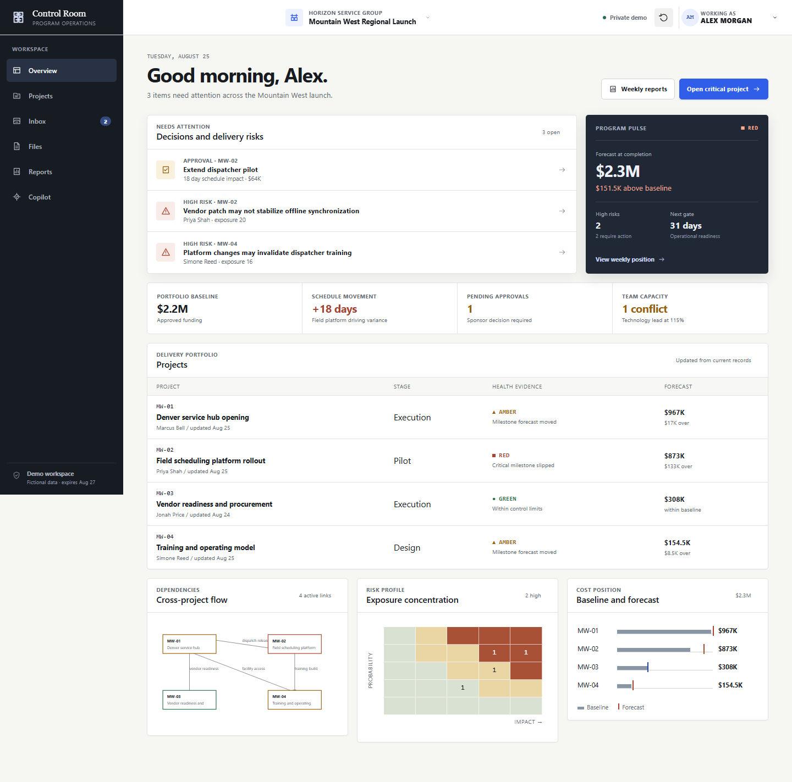
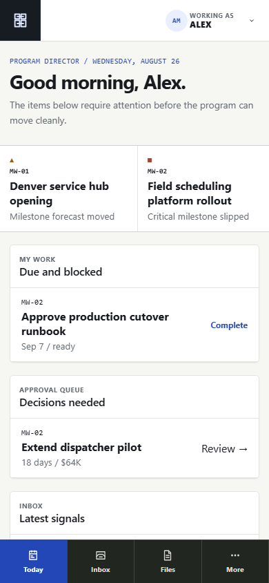

# Control Room

[Live application](https://control-room-pmo.spacebaii-portfolio.workers.dev) · [Case study](docs/CASE_STUDY.md) · [Development journal](docs/DEVELOPMENT_JOURNAL.md)


Control Room is an operations PMO suite that demonstrates how a regional rollout can be managed from charter through execution, change control, reporting, and closeout. It is built around a fictional Horizon Service Group program with deliberately uneven schedules, budgets, risks, vendors, and team capacity.

The public application is safe to explore: every visitor receives an isolated 24-hour workspace, all people and records are synthetic, and communication adapters never contact Slack, Teams, or email. Public PM copilot workflows use deterministic rules and templates with no model charges.

## Why it exists

Most project-management demos stop at a clean task board. Control Room focuses on the difficult operating work around the board: attributable health, cross-project dependencies, forecast pressure, RAID aging, approval authority, evidence, reporting, and audit history.

This repository is both a shippable product demonstration and an engineering case study in multi-tenant data boundaries, optimistic concurrency, deterministic AI fallbacks, and Cloudflare-native architecture.

## Product capabilities

- Portfolio health with machine-readable red, amber, and green evidence
- Hybrid plans with milestones, dependencies, work packages, and execution boards
- RAID and decision registers with owners, response plans, rationale, and downstream effects
- Budget, commitment, forecast, vendor, and resource-capacity controls
- Change submission, sponsor decision, and baseline implementation workflows
- Evidence-backed report drafting, review, approval, publication, printing, and history
- Simulated Slack, Teams, and email previews with explicit delivery approval
- Versioned synthetic PDFs and Excel workbooks with working downloads
- Mobile-specific Today, Inbox, Files, comments, and approvals experience
- Deterministic public PM copilot and owner-only OpenAI proposals
- Immutable audit events, record versions, CSV exports, and signed demo sessions





## Architecture

Control Room uses one Cloudflare Worker for both the React application and `/api/v1/*` routes.

```text
Browser
  |-- React 19 SPA + React Router
  |-- signed 24-hour demo cookie
  v
Cloudflare Worker
  |-- Zod HTTP validation
  |-- application workflows + permissions
  |-- health engine + deterministic copilot
  |-- GitHub OAuth + owner-only OpenAI adapter
  v
Cloudflare D1
  |-- workspace-scoped project aggregates
  |-- messages, reports, files, usage, and audit events
  +-- optimistic record versions
```

The code separates domain rules, application workflows, and infrastructure adapters. See [Architecture](docs/ARCHITECTURE.md), [Data dictionary](docs/DATA_DICTIONARY.md), and [ADR index](docs/adr/README.md).

## Tech stack

- React 19, TypeScript, Vite, React Router
- Cloudflare Workers, Static Assets, D1, Wrangler
- Zod at HTTP boundaries
- Vitest and Playwright
- ESLint, generated Worker types, GitHub Actions
- Raw GitHub OAuth and OpenAI HTTP adapters

No component library, chart framework, state-management framework, external font service, or production AI SDK is used.

## Local installation

Requirements: Node.js 22+, npm, and a Cloudflare account only when deploying.

```bash
git clone https://github.com/SpacebaII/control-room.git
cd control-room
npm install
copy .dev.vars.example .dev.vars
npm run types:worker
npm run db:local
npm run dev
```

Open `http://127.0.0.1:5173`. Placeholder OAuth and OpenAI values are sufficient for public demo mode.

## Owner mode configuration

Register a GitHub OAuth application with callback URL:

```text
https://control-room-pmo.spacebaii-portfolio.workers.dev/auth/github/callback
```

Set these Worker secrets; never commit them:

```text
GITHUB_CLIENT_ID
GITHUB_CLIENT_SECRET
GITHUB_ALLOWED_LOGIN
SESSION_SIGNING_SECRET
OPENAI_API_KEY
```

The default live model is `gpt-5-nano` and can be changed with `OPENAI_MODEL`. Owner mode is limited to 20 UTC runs per day, sends bounded synthetic evidence, disables provider response storage, and can only create reviewable proposals.

## Quality commands

```bash
npm run lint
npm run typecheck
npm test -- --coverage
npm run test:e2e
npm run build
npm run check
```

The browser suite covers isolation, permissions, schedule movement, risk response, changes, forecasts, capacity, reporting, simulated communications, deterministic copilot behavior, files, and mobile overflow.

## Project structure

```text
src/domain/          business records and health rules
src/application/     use cases, ports, and synthetic seed portfolio
src/components/      code-native operational visuals
worker/              HTTP, D1, OAuth, sessions, and provider adapters
migrations/          numbered D1 schema migrations
public/demo-files/   synthetic evidence artifacts
tests/               domain and application tests
e2e/                 browser acceptance workflows
docs/                architecture, security, decisions, and case-study notes
```

## Deployment

Create a dedicated D1 database, replace the placeholder `database_id` in `wrangler.jsonc`, configure secrets, then run:

```bash
npm run db:remote
npm run deploy
```

Deployment and rollback details are in [Operations](docs/OPERATIONS.md).

## Roadmap

- Real organization invitations and team authentication
- User file uploads backed by R2 with malware scanning
- Optional real Slack, Teams, and email adapters
- Portfolio templates and configurable health policies
- Cross-program capacity planning and scenario comparison
- Durable workflow orchestration for long-running approvals

## Fictional-data notice

Horizon Service Group, its program, people, vendors, values, documents, and communications are fictional. They exist only to demonstrate realistic operating behavior.

## License

[MIT](LICENSE)
